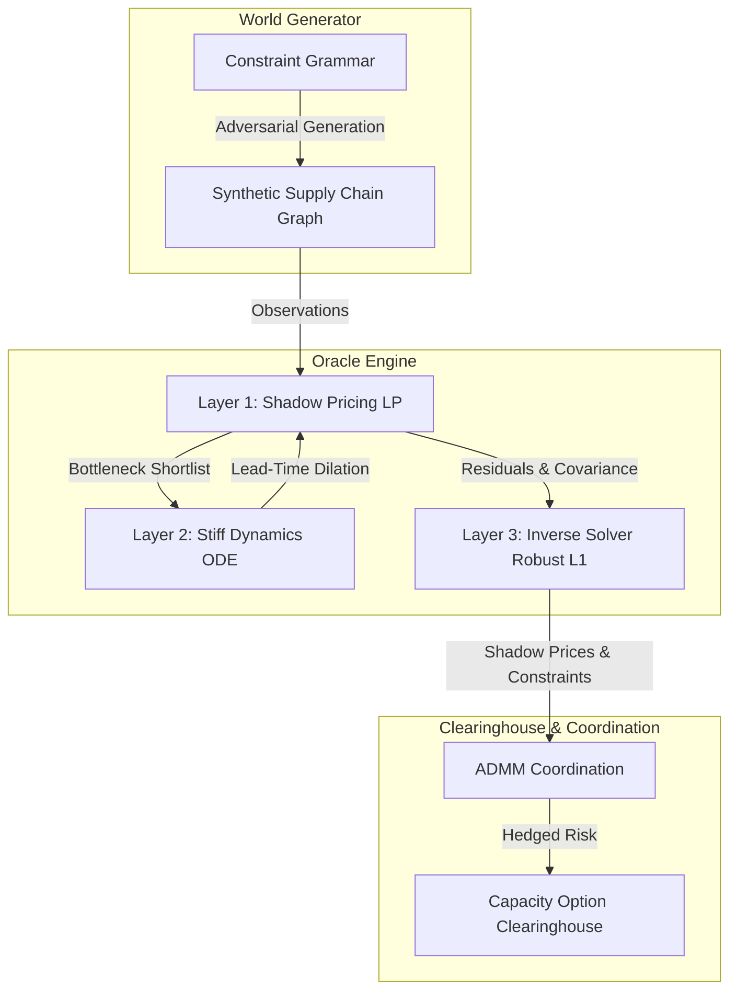

# Phantom Veil: Constraint Space Simulator & Clearinghouse

Phantom Veil is a B2B decision and pricing engine designed to identify and mitigate **"phantom bottlenecks"** in deep-tier supply chains (such as advanced packaging CoWoS, HBM, or 800G/1.6T optical transceivers) during extreme demand shocks.

Traditional supply chain management focuses on static visibility and linear lead-time summation. Phantom Veil redefines supply chain modeling as a dynamic system governed by queueing theory, information asymmetry, and mechanism design.

---

## 🌌 Core Philosophy: What is a "Phantom Bottleneck"?

A **phantom bottleneck** is not merely a company that goes down; it is **a qualified transformation capacity** in a specific time window that:
1. Is highly specialized and has no immediate substitutes.
2. Has long qualification/certification delays.
3. Cannot easily expand capacity.
4. Is hidden deep within the tier-3 or tier-4 supplier networks (e.g., specialty adhesives, test fixtures, high-purity precursor gases).
5. Reports distorted or deceptive capacity signals (information asymmetry).

Under demand shocks, these low-visibility nodes hit high utilization rates, causing their lead times to explode non-linearly (time-dilation) and their effective yield to collapse, triggering systemic supply chain failures while surface-level nodes (Tier 1/Tier 2) appear to have sufficient capacity.

---

## 🛠️ System Architecture

Phantom Veil is organized into four coupled computational layers:



### 1. The World Generator (Adversarial Benchmark Sandbox)
To avoid the **epistemic trap** of self-fulfilling validation (where the simulator only finds the bottlenecks manually inserted by the creator), Phantom Veil features a graph generator that compiles random, industrially-coherent supply chain networks.
* Governed by an industrial constraint grammar (Process Classes, Resource Classes, Dark Constraints).
* Edges are generated probabilistically based on compatibility (process, qualification, geography, contracts) rather than pure preferential attachment.

### 2. The Oracle Engine (Stiff Dynamics & Optimization)
* **Layer 1 (Time-Expanded LP):** Solves flow optimization and extracts Lagrange multipliers (Shadow Prices $\lambda$) to value capacity options.
* **Layer 2 (Continuous Stiff Queueing ODEs):** Models queues ($Q$) and utilization ($\rho$). Uses implicit solvers (**BDF/Radau**) to integrate through the extreme stiffness of capacity collapse where $\rho \to 1$. Couples queueing delays with sigmoid yield-degradation curves (maintenance debt).
* **Layer 3 (Inverse Solver):** Formulates a pathological inverse problem to reconstruct hidden deep-tier constraints from sparse, noisy downstream signals using L1 regularization (sparse prior) and Huber/Soft-L1 robust losses.

### 3. The Clearinghouse & Coordination Layer
* **ADMM Coordination:** Employs the Alternating Direction Method of Multipliers to coordinate global optimization across suppliers without requiring them to share raw capacity, cost, or topology明文.
* **Capacity Option Clearinghouse:** Employs Column Generation to bundle path/topology changes into standardized capacity options, pricing risk and preventing panic-driven supply runs (monitored by the Panic Reproduction Number $R_p$).

---

## 📅 The 10-Day MVP Sandbox Roadmap

| Phase | Days | Focus | Deliverables / Outputs |
| :--- | :--- | :--- | :--- |
| **Phase 1** | Day 1-2 | **Constraint Space & World Gen** | Synthesizer generating random, industrially valid 50-node networks ($A$, $C_u$). |
| **Phase 2** | Day 3-4 | **Dynamic LP & Stiff Solver** | `time_expanded_lp.py` and `queue_dynamics.py` solving LP flow and implicit BDF ODE integration. |
| **Phase 3** | Day 5-6 | **Inverse Solver & Anti-Noise** | `inverse_bottleneck.py` extracting Tier 4 bottlenecks via robust sparse regression. |
| **Phase 4** | Day 7-8 | **Streamlit Interactive UI** | Web dashboard featuring demand shock sliders, PyVis network graphs, and risk analysis. |
| **Phase 5** | Day 9-10 | **Backcasting & Benchmarks** | Testing the engine against historical supply disruptions and blind benchmarks. |

---

## 🚀 Getting Started

### Prerequisites
- Node.js (for global `meta-harness` CLI)
- Python 3.10+

### Setup
1. **Install Meta-Harness globally:**
   ```powershell
   npm install -g E:\code\meta-harness
   ```
2. **Set up Python virtual environment:**
   ```powershell
   python -m venv .venv
   # On Windows (PowerShell):
   .\.venv\Scripts\Activate.ps1
   # On Linux/macOS:
   source .venv/bin/activate
   ```
3. **Upgrade pip and install the package with development dependencies:**
   ```powershell
   python -m pip install -U pip
   pip install -e ".[dev]"
   ```
4. **Check project status:**
   ```powershell
   meta-harness status
   ```

---

## 📜 License
Proprietary. Developed under the Phantom Veil research project.
