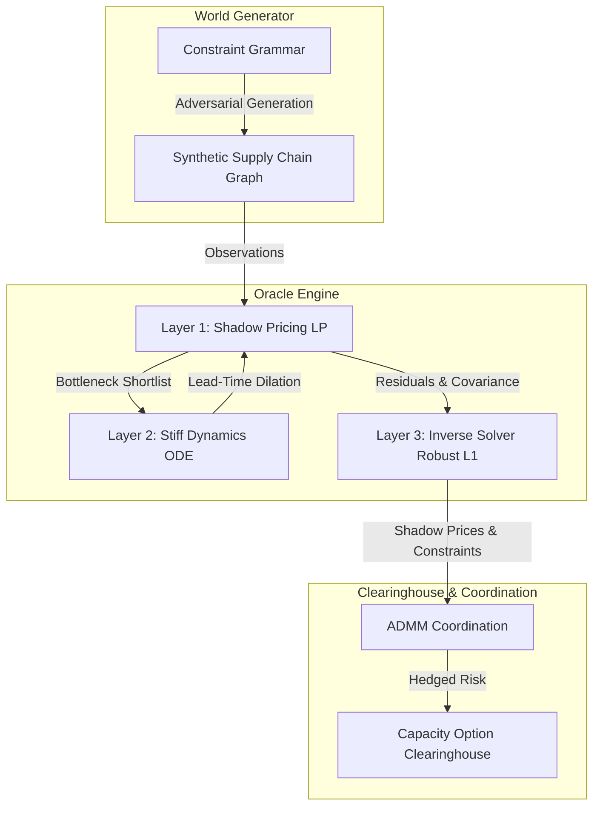

# Phantom Veil: Constraint Space Simulator & Clearinghouse

Phantom Veil is a B2B decision and pricing engine designed to identify and mitigate **"phantom bottlenecks"** in deep-tier supply chains (such as advanced packaging CoWoS, HBM, or 800G/1.6T optical transceivers) during extreme demand shocks.

Traditional supply chain management focuses on static visibility and linear lead-time summation. Phantom Veil redefines supply chain modeling as a dynamic system governed by queueing theory, information asymmetry, and mechanism design.

---

## 🌌 Core Philosophy: What is a "Phantom Bottleneck"?

A **phantom bottleneck** is not merely a company that goes down; it is **a qualified transformation capacity** in a specific time window that:
1. Is highly specialized and has no immediate substitutes.
2. Has long qualification/certification delays.
3. Cannot easily expand capacity.
4. Is hidden deep within the tier-3 or tier-4 supplier networks (e.g., specialty adhesives, test fixtures, high-purity precursor gases).
5. Reports distorted or deceptive capacity signals (information asymmetry).

Under demand shocks, these low-visibility nodes hit high utilization rates, causing their lead times to explode non-linearly (time-dilation) and their effective yield to collapse, triggering systemic supply chain failures while surface-level nodes (Tier 1/Tier 2) appear to have sufficient capacity.

---

## 🛠️ System Architecture

Phantom Veil is organized into four coupled computational layers:



### 1. The World Generator (Adversarial Benchmark Sandbox)
To avoid the **epistemic trap** of self-fulfilling validation (where the simulator only finds the bottlenecks manually inserted by the creator), Phantom Veil features a graph generator that compiles random, industrially-coherent supply chain networks.
* Governed by an industrial constraint grammar (Process Classes, Resource Classes, Dark Constraints).
* Edges are generated probabilistically based on compatibility (process, qualification, geography, contracts) rather than pure preferential attachment.

### 2. The Oracle Engine (Stiff Dynamics & Optimization)
* **Layer 1 (Time-Expanded LP):** Solves flow optimization and extracts Lagrange multipliers (Shadow Prices $\lambda$) to value capacity options.
* **Layer 2 (Continuous Stiff Queueing ODEs):** Models queues ($Q$) and utilization ($\rho$). Uses implicit solvers (**BDF/Radau**) to integrate through the extreme stiffness of capacity collapse where $\rho \to 1$. Couples queueing delays with sigmoid yield-degradation curves (maintenance debt).
* **Layer 3 (Inverse Solver):** Formulates a pathological inverse problem to reconstruct hidden deep-tier constraints from sparse, noisy downstream signals using L1 regularization (sparse prior) and Huber/Soft-L1 robust losses.

### 3. The Clearinghouse & Coordination Layer
* **ADMM Coordination:** Employs the Alternating Direction Method of Multipliers to coordinate global optimization across suppliers without requiring them to share raw capacity, cost, or topology明文.
* **Capacity Option Clearinghouse:** Employs Column Generation to bundle path/topology changes into standardized capacity options, pricing risk and preventing panic-driven supply runs (monitored by the Panic Reproduction Number $R_p$).

---

## 📅 The 10-Day MVP Sandbox Roadmap

| Phase | Days | Focus | Deliverables / Outputs |
| :--- | :--- | :--- | :--- |
| **Phase 1** | Day 1-2 | **Constraint Space & World Gen** | Synthesizer generating random, industrially valid 50-node networks ($A$, $C_u$). |
| **Phase 2** | Day 3-4 | **Dynamic LP & Stiff Solver** | `time_expanded_lp.py` and `queue_dynamics.py` solving LP flow and implicit BDF ODE integration. |
| **Phase 3** | Day 5-6 | **Inverse Solver & Anti-Noise** | `inverse_bottleneck.py` extracting Tier 4 bottlenecks via robust sparse regression. |
| **Phase 4** | Day 7-8 | **Streamlit Interactive UI** | Web dashboard featuring demand shock sliders, PyVis network graphs, and risk analysis. |
| **Phase 5** | Day 9-10 | **Backcasting & Benchmarks** | Testing the engine against historical supply disruptions and blind benchmarks. |

---

## 🧮 MVP-002 LP Solver

The LP Solver module implements the time-expanded supply-chain shortage minimization linear program. It maps production, flow, served, and shortage variables across weeks, solves using `scipy.optimize.linprog(method="highs")`, and extracts capacity constraint shadow prices.

### Shadow-Price Sign Convention

In mathematical optimization:
- SciPy's HiGHS solver returns marginals representing the sensitivity of the objective function with respect to the right-hand-side constraint values ($\frac{\partial \text{Objective}}{\partial \text{RHS}}$).
- For a shortage minimization LP, adding capacity reduces shortage (loss decreases), resulting in a negative raw marginal.
- Business shadow values must be positive to reflect the benefit of additional capacity.
- The business shadow value is defined as:
  $$\text{capacity\_shadow\_value} = -\text{raw\_marginal}$$
- A finite-difference sensitivity check verifies this sign convention.

### Quickstart Example

The following example demonstrates how to generate a synthetic supply chain world, run the LP solver, and print the top shadow prices:

```python
import pandas as pd
from phantom_veil.worldgen import generate_world
from phantom_veil.solver import solve_shortage_lp

# 1. Generate a deterministic supply chain world
nodes, edges, demands, _ = generate_world(seed=42, node_count=50, horizon_weeks=52)

# 2. Solve the time-expanded LP model
result = solve_shortage_lp(nodes, edges, demands)

# 3. Print the top capacity shadow prices
print("Success:", result.success)
print("Objective Value (Total Shortage):", result.objective_value)

# Find top capacity shadow prices
top_prices = result.capacity_shadow_prices.sort_values(
    by="capacity_shadow_value", ascending=False
).head(10)
print("\nTop 10 Capacity Shadow Prices:")
print(top_prices.to_string(index=False))
```

---

## 📊 MVP-003 Bottleneck Benchmark Harness

The benchmark harness allows you to evaluate the offline bottleneck classification accuracy over a set of synthetic supply chain seeds. It computes precision, recall, top-k overlap, and shortage reduction achieved by restoring predicted bottlenecks back to their nominal capacities.

### Quickstart Benchmark Example

```python
from phantom_veil.benchmark import run_benchmark_suite

# Run the benchmark suite over a list of random seeds
results = run_benchmark_suite(
    seeds=[11, 22, 33],
    node_count=30,
    horizon_weeks=26,
    top_k=3,
    use_true_capacities=True
)

print("Average Precision@k:", results["precision@k"])
print("Average Recall@k:", results["recall@k"])
print("Average Top-k Overlap Count:", results["top_k_overlap"])
print("Average Shortage Reduction:", results["shortage_reduction"])
```

## 🎭 MVP-004 Scenario Perturbation Engine

The Scenario Perturbation Engine allows users to define repeatable scenario shocks and interventions to measure how demand surges, capacity shocks, transit delays, and candidate capacity additions affect shortages and bottleneck rankings.

### Quickstart Scenario Example

```python
from phantom_veil.worldgen import generate_world
from phantom_veil.scenarios import ScenarioSpec, run_scenario, compare_scenarios

# 1. Generate a supply chain network
nodes, edges, demands, _ = generate_world(seed=42, node_count=10, horizon_weeks=5)

# 2. Define a scenario spec (e.g., a demand shock during weeks 2 and 3)
spec_base = ScenarioSpec(scenario_id="base")
spec_perturbed = ScenarioSpec(
    scenario_id="perturbed_demand_shock",
    demand_multiplier=2.5,
    weeks=[2, 3]
)

# 3. Run scenarios
res_base = run_scenario(nodes, edges, demands, spec_base)
res_perturbed = run_scenario(nodes, edges, demands, spec_perturbed)

# 4. Compare results
diff = compare_scenarios(res_base, res_perturbed, top_k=3)
print("Objective Delta:", diff["objective_delta"])
print("Total Shortage Delta:", diff["total_shortage_delta"])
print("Top-k rank changes:")
for node_id, change in diff["top_k_bottleneck_rank_changes"].items():
    print(f"  Node {node_id}: Base Rank {change['base_rank']} -> Scenario Rank {change['scenario_rank']}")
```

## 📋 MVP-005 Decision Report Artifact

The Decision Report module provides a deterministic report generator that aggregates LP Optimization results, Scenario runs, Interventions, and Offline Benchmarks into formatted Markdown or JSON artifacts. It enforces a strict information-barrier constraint, preventing ground-truth supplier bottleneck status from leaking into operator-facing sections of the report.

### Quickstart Report Example

```python
from phantom_veil.worldgen import generate_world
from phantom_veil.scenarios import ScenarioSpec, run_scenario, evaluate_intervention_set
from phantom_veil.reporting import ReportConfig, build_decision_report, export_report_markdown

# 1. Generate supply chain data
nodes, edges, demands, _ = generate_world(seed=42, node_count=10, horizon_weeks=5)

# 2. Run baseline and perturbed scenarios
spec_base = ScenarioSpec(scenario_id="base")
res_base = run_scenario(nodes, edges, demands, spec_base)

spec_perturbed = ScenarioSpec(scenario_id="shock", demand_multiplier=2.0, weeks=[2, 3])
res_perturbed = run_scenario(nodes, edges, demands, spec_perturbed)

# 3. Evaluate intervention set effectiveness
interv_metrics = evaluate_intervention_set(nodes, edges, demands, top_k=2, capacity_increment=100.0)

# 4. Generate the Decision Report
config = ReportConfig(
    report_id="REP_Q3_VULN",
    seed=42,
    top_k=2,
    scenario_ids=["shock"]
)

report = build_decision_report(
    nodes=nodes,
    edges=edges,
    demands=demands,
    config=config,
    baseline_result=res_base,
    perturbed_results={"shock": res_perturbed},
    intervention_metrics=interv_metrics
)

# 5. Export and print the report
markdown_output = export_report_markdown(report)
print(markdown_output)
```

## 🌀 MVP-006 Stiff Queue Dynamics ODE Adapter

The Queue Dynamics module integrates a continuous-time queueing model for the top bottleneck nodes identified by the LP solver. It uses SciPy's `solve_ivp` with implicit stiff solvers (such as BDF) to simulate queue lengths $Q(t)$, capacity utilization $\rho(t)$, and lead-time multipliers over time under unconstrained demand pressure.

### Quickstart Dynamics Example

```python
from phantom_veil.worldgen import generate_world
from phantom_veil.scenarios import ScenarioSpec, run_scenario
from phantom_veil.dynamics import QueueDynamicsConfig, simulate_queue_dynamics, summarize_dynamic_risk

# 1. Generate supply chain and solve baseline
nodes, edges, demands, _ = generate_world(seed=42, node_count=10, horizon_weeks=5)
spec_base = ScenarioSpec(scenario_id="base")
res_base = run_scenario(nodes, edges, demands, spec_base)

# 2. Configure and run continuous queue dynamics
dyn_config = QueueDynamicsConfig(
    method="BDF",
    horizon_days=30,
    top_k=2,
    utilization_warning_threshold=0.90
)
dyn_result = simulate_queue_dynamics(nodes, edges, demands, res_base, dyn_config)

# 3. Summarize risk
summary = summarize_dynamic_risk(dyn_result)
print("Max queue size per node:", summary["max_queue_by_node"])
print("Warnings generated:", summary["warnings"])
```

---

## 🚀 Getting Started

### Prerequisites
- Node.js (for global `meta-harness` CLI)
- Python 3.10+

### Setup
1. **Install Meta-Harness globally:**
   ```powershell
   npm install -g E:\code\meta-harness
   ```
2. **Set up Python virtual environment:**
   ```powershell
   python -m venv .venv
   # On Windows (PowerShell):
   .\.venv\Scripts\Activate.ps1
   # On Linux/macOS:
   source .venv/bin/activate
   ```
3. **Upgrade pip and install the package with development dependencies:**
   ```powershell
   python -m pip install -U pip
   pip install -e ".[dev]"
   ```
4. **Check project status:**
   ```powershell
   meta-harness status
   ```

---

## 📜 License
Proprietary. Developed under the Phantom Veil research project.
